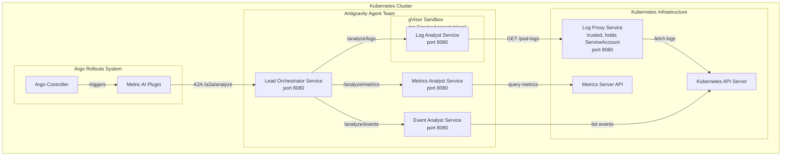
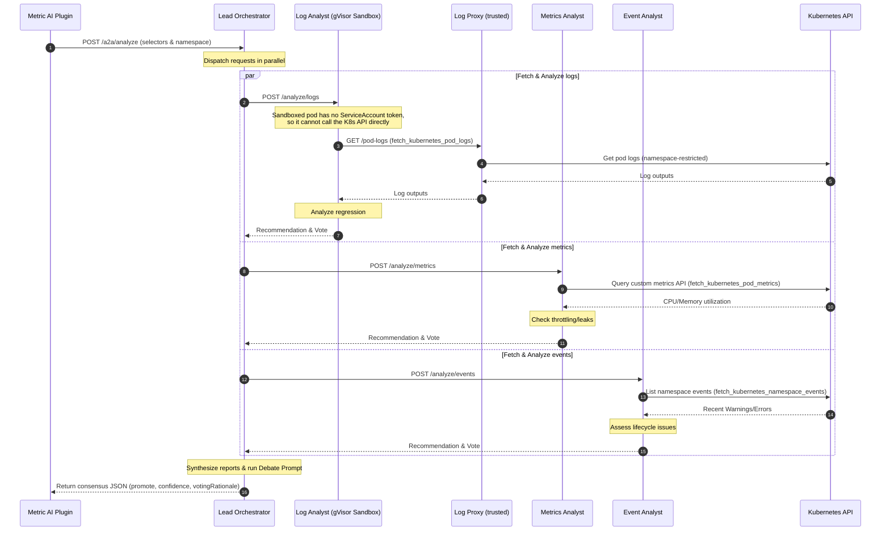

# Kubernetes AI/Ops Agent Team - Google Antigravity SDK

This repository implements a **Collaborative Team of Specialized AI Agents** to analyze Kubernetes canary deployments. Built using the **Google Antigravity SDK**, this team evaluates logs, resource utilization, and lifecycle events concurrently, resolving any voting conflicts through an orchestrator-led debate.

---

## Architecture Diagram

The diagram below outlines the relationships between Argo Rollouts, the metric plugin, and the distributed agent team:



---

## Sequence Diagram

The sequence diagram below displays the concurrent scatter-gather execution and debate process:



---

## Agent Roles & SDK Configuration

The agent microservices run a single unified Docker container image, configured via CLI parameters at startup:

1. **Lead Orchestrator (`--role orchestrator`)**
   * Configured via [orchestrator.py](file:///Users/sanchezg/dev/carlossg/argo-rollouts/rollouts-plugin-metric-ai/kubernetes-agents-antigravity/agents/orchestrator.py).
   * Orchestrates the specialist subagents. If the specialists return conflicting recommendations, it prompts Gemini to debate the reports and yield a final unified JSON consensus block.
2. **Log Analyst (`--role logs`)**
   * Configured via [logs.py](file:///Users/sanchezg/dev/carlossg/argo-rollouts/rollouts-plugin-metric-ai/kubernetes-agents-antigravity/agents/logs.py).
   * Runs the `LogAnalystAgent` which calls `fetch_kubernetes_pod_logs` to analyze application log differences between stable and canary versions.
   * This is the only agent that runs inside a **gVisor sandbox** (see [Sandboxed Log Analyst & Log Proxy](#sandboxed-log-analyst--log-proxy) below) instead of a plain Deployment, since it is the only agent whose tool call is derived from LLM output rather than a fixed, code-defined query.
3. **Metrics Analyst (`--role metrics`)**
   * Configured via [metrics.py](file:///Users/sanchezg/dev/carlossg/argo-rollouts/rollouts-plugin-metric-ai/kubernetes-agents-antigravity/agents/metrics.py).
   * Runs the `MetricsAnalystAgent` which calls `fetch_kubernetes_pod_metrics` to verify that CPU or memory consumption has not experienced spikes or leaks.
4. **Event Analyst (`--role events`)**
   * Configured via [events.py](file:///Users/sanchezg/dev/carlossg/argo-rollouts/rollouts-plugin-metric-ai/kubernetes-agents-antigravity/agents/events.py).
   * Runs the `EventAnalystAgent` which calls `fetch_kubernetes_namespace_events` to monitor warning event streams for crash loops or probe failures.

---

## Sandboxed Log Analyst & Log Proxy

The Log Analyst is the only agent whose Kubernetes queries (namespace and label selector) are chosen by the LLM rather than passed in as fixed values from the orchestrator's request context. To limit the blast radius if the model is tricked into requesting logs from an unintended namespace, it runs with defense in depth:

* **gVisor sandbox** — [k8s/log-analyst-sandbox.yaml](file:///Users/sanchezg/dev/carlossg/argo-rollouts/rollouts-plugin-metric-ai/kubernetes-agents-antigravity/k8s/log-analyst-sandbox.yaml) deploys it as a `Sandbox` custom resource (`agents.x-k8s.io/v1alpha1`) rather than a plain `Deployment`. It sets `runtimeClassName: gvisor`, schedules onto `sandbox.gke.io/runtime: gvisor` nodes, and sets `automountServiceAccountToken: false`, so the pod has no Kubernetes API credentials at all even if compromised.
* **Trusted log-proxy service** — since the sandboxed pod can't call the Kubernetes API directly, its `fetch_kubernetes_pod_logs` tool ([agents/logs.py](file:///Users/sanchezg/dev/carlossg/argo-rollouts/rollouts-plugin-metric-ai/kubernetes-agents-antigravity/agents/logs.py)) calls out over HTTP (`LOG_PROXY_URL`) to the `kubernetes-agent-log-proxy` Deployment, a normal (non-sandboxed) service that holds the `kubernetes-agents-sa` ServiceAccount and its cluster-wide pod/log read access.
* **Namespace allow-list on the proxy** — [agents/log_proxy.py](file:///Users/sanchezg/dev/carlossg/argo-rollouts/rollouts-plugin-metric-ai/kubernetes-agents-antigravity/agents/log_proxy.py) rejects requests for `FORBIDDEN_NAMESPACES` (`kube-system`, `kube-public`, `kube-node-lease`, `argo-rollouts`), so even a compromised or misled Log Analyst cannot use the proxy to read logs from cluster-critical or agent-team namespaces.

This requires the cluster to have gVisor (`RuntimeClass` named `gvisor`) and the `agents.x-k8s.io` `Sandbox` CRD installed; see the [GKE sandbox docs](https://cloud.google.com/kubernetes-engine/docs/how-to/sandbox-pods) for setup.

---

## Getting Started

### Prerequisites
* Python 3.11+
* Docker
* Kubernetes cluster (e.g. Kind)
* gVisor `RuntimeClass` and the `agents.x-k8s.io` `Sandbox` CRD installed, for running the Log Analyst sandboxed (see [Sandboxed Log Analyst & Log Proxy](#sandboxed-log-analyst--log-proxy))

### 1. Build the Docker Image
Build the multi-role container image locally:
```bash
docker build -t kubernetes-agents-antigravity:latest .
```

### 2. Deploy to Kubernetes
Apply the ServiceAccount, RBAC rules, Services, and Deployments (including the sandboxed Log Analyst and its Log Proxy) to your cluster via the [kustomization](file:///Users/sanchezg/dev/carlossg/argo-rollouts/rollouts-plugin-metric-ai/kubernetes-agents-antigravity/k8s/kustomization.yaml):
```bash
kubectl apply -k k8s/
```

This applies both [agents.yaml](file:///Users/sanchezg/dev/carlossg/argo-rollouts/rollouts-plugin-metric-ai/kubernetes-agents-antigravity/k8s/agents.yaml) (ServiceAccount, RBAC, and the orchestrator/metrics/events/log-proxy Services and Deployments) and [log-analyst-sandbox.yaml](file:///Users/sanchezg/dev/carlossg/argo-rollouts/rollouts-plugin-metric-ai/kubernetes-agents-antigravity/k8s/log-analyst-sandbox.yaml) (the gVisor-sandboxed Log Analyst).

### 3. Verification & Testing
To test the analysis loop independently, run the following test curl script inside the orchestrator container:
```bash
kubectl exec -n argo-rollouts deployment/kubernetes-agent-orchestrator -- python3 -c "
import urllib.request, json
req_data = {
  'userId': 'argo-rollouts',
  'prompt': 'Analyze canary deployment for rollout canary-demo.',
  'context': {
    'namespace': 'rollouts-test-system',
    'rolloutName': 'canary-demo',
    'stableSelector': 'role=stable',
    'canarySelector': 'role=canary'
  }
}
req = urllib.request.Request(
    'http://localhost:8080/a2a/analyze',
    data=json.dumps(req_data).encode(),
    headers={'Content-Type': 'application/json'}
)
print(urllib.request.urlopen(req).read().decode())
"
```
